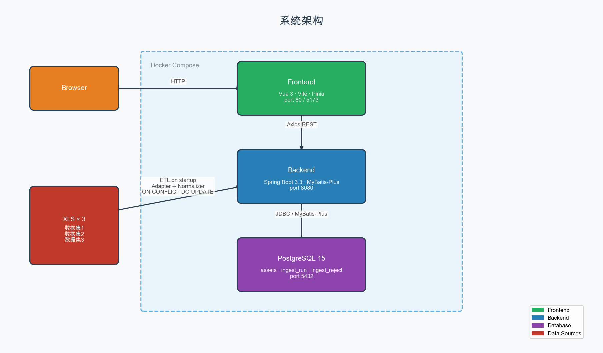

# 视频素材查询服务

> **架构师的完整技术决策链**：从访问模式分析 → 存储选型 → Schema 设计 → 安全防护 → 演进路径，每一步都有明确依据，拒绝"因为流行所以选择"。

---

## 技术架构


## 功能架构

```
┌─────────────────────────────────────────────────────────────────────────────────┐
│                              视频素材管理系统                                      │
├─────────────────────────────────────────────────────────────────────────────────┤
│                                   前端层                                          │
│  ┌──────────┐  ┌──────────┐  ┌──────────┐  ┌──────────┐  ┌──────────────────┐  │
│  │ 数据概览 │  │ 素材列表 │  │ 素材详情 │  │ 运维监控 │  │ Excel 上传导入   │  │
│  │ Dashboard│  │ 列表筛选 │  │ 详情展示 │  │ Actuator │  │ 拖拽上传/删除    │  │
│  └──────────┘  └──────────┘  └──────────┘  └──────────┘  └──────────────────┘  │
├─────────────────────────────────────────────────────────────────────────────────┤
│                                   API 层                                          │
│  ┌─────────────────────────────┐  ┌─────────────────────────────┐               │
│  │        查询 API (只读)       │  │        写入 API (需认证)    │               │
│  ├─────────────────────────────┤  ├─────────────────────────────┤               │
│  │ GET  /assets         列表   │  │ POST /assets/upload  上传   │               │
│  │ GET  /assets/cursor  分页   │  │ DEL  /assets/{id}    删除   │               │
│  │ GET  /assets/{id}    详情   │  │ DEL  /assets/batch   批量删 │               │
│  │ GET  /stats          统计   │  │ DEL  /assets/by-query 条件删│               │
│  └─────────────────────────────┘  └─────────────────────────────┘               │
├─────────────────────────────────────────────────────────────────────────────────┤
│                                  安全防护层                                       │
│  ┌──────────────┐  ┌──────────────┐  ┌──────────────┐  ┌──────────────────┐    │
│  │ Bucket4j 限流│  │ API Key 认证 │  │ RBAC 权限    │  │ SQL 注入防护     │    │
│  │ 10 req/s    │  │ 白名单匹配   │  │ USER/ADMIN  │  │ 四层纵深防御     │    │
│  └──────────────┘  └──────────────┘  └──────────────┘  └──────────────────┘    │
├─────────────────────────────────────────────────────────────────────────────────┤
│                                  业务逻辑层                                       │
│  ┌──────────────┐  ┌──────────────┐  ┌──────────────┐  ┌──────────────────┐    │
│  │ 查询服务     │  │ 写入服务     │  │ 统计服务     │  │ ETL 导入服务     │    │
│  │ DSL 解析     │  │ 幂等写入     │  │ Q1/Q2/Q3    │  │ 归一化/适配器    │    │
│  └──────────────┘  └──────────────┘  └──────────────┘  └──────────────────┘    │
├─────────────────────────────────────────────────────────────────────────────────┤
│                                  数据访问层                                       │
│  ┌──────────────────────────────────────────────────────────────────────────┐   │
│  │  MyBatis-Plus + XML 动态 SQL  │  PostgreSQL text[] TypeHandler  │  Upsert │   │
│  └──────────────────────────────────────────────────────────────────────────┘   │
├─────────────────────────────────────────────────────────────────────────────────┤
│                                  数据存储层                                       │
│  ┌──────────────────────────────────────────────────────────────────────────┐   │
│  │  PostgreSQL 15  │  text[] 数组  │  JSONB 稀疏字段  │  8 个业务索引        │   │
│  └──────────────────────────────────────────────────────────────────────────┘   │
├─────────────────────────────────────────────────────────────────────────────────┤
│                                  可观测性                                         │
│  ┌──────────────┐  ┌──────────────┐  ┌──────────────┐  ┌──────────────────┐    │
│  │ Actuator     │  │ Prometheus   │  │ 业务指标     │  │ Swagger UI       │    │
│  │ health/info  │  │ /metrics     │  │ API延迟/计数 │  │ API 文档         │    │
│  └──────────────┘  └──────────────┘  └──────────────┘  └──────────────────┘    │
└─────────────────────────────────────────────────────────────────────────────────┘
```

### 功能模块说明

| 模块 | 功能点 | 技术实现 |
|------|--------|----------|
| **数据概览** | 统计卡片、趋势图表 | Vue 3 + ECharts |
| **素材列表** | 多字段筛选、排序、分页 | 自研 DSL + Cursor 分页 |
| **素材详情** | 完整信息展示、关联数据 | 动态字段选择 |
| **运维监控** | 健康检查、指标查看、API 文档 | Actuator + Prometheus |
| **Excel 导入** | 拖拽上传、自动识别格式、幂等写入 | Apache POI + 3 套适配器 |
| **数据删除** | 单条/批量/条件删除 | RBAC 权限控制 |
| **安全防护** | 限流、认证、注入防护 | Bucket4j + Spring Security |
| **可观测性** | 监控指标、API 文档 | Micrometer + SpringDoc |

---

## 核心技术挑战

**这是异构数据集成问题，不是简单 CRUD。**  三份来自不同业务系统的 XLS 文件，**全部字段都不一致**：

| 维度 | 数据集1 | 数据集2 | 数据集3 |
|------|---------|---------|---------|
| 时间格式 | Excel 序列号整数 | Excel 序列号含小数 | Unix 秒时间戳 |
| 文件大小 | 字符串 `"63.76MB"` | 字节整数 | 数值+单位双列 |
| 审核状态 | 中文 | 英文 | 中英混合 |
| 标签分隔符 | 分号 `;` | 逗号 `,` | Python list 字符串 |

本项目解决了 后续可上传100或1000 等等数据， 后端自动识别规划， 数据集配置化映射方案，避免反复开发，快速支持业务发展。 配置参考：[动态数据集适配指南](main/docs/dataset-mapping-guide.md)

---

## 架构决策摘要（重点）

### 决策 1：选 PostgreSQL 而非 ElasticSearch

**访问模式决定存储选型，不是技术热度。**

| 访问模式 | PostgreSQL | ElasticSearch |
|----------|------------|---------------|
| 结构化过滤 + 数值范围 | B-tree O(log n) | 倒排索引，非本职 |
| GROUP BY 聚合 | SQL 原生 | Aggregation bucket，复杂 |
| `text[] @>` 数组包含 | GIN 索引直接支持 | nested field 复杂 |
| ETL 后立即一致读 | ACID，写完可查 | 1s refresh 延迟 |
| 幂等写入 | `ON CONFLICT DO UPDATE` | 无原生 upsert |

**ES 的优势（全文检索、亿级 facet）本题不存在。选 ES 是过度设计。**

**演进路径**：全文检索需求出现时 → Debezium CDC → Kafka → ES 读侧投影，PG 仍是 Source of Truth。

---

### 决策 2：自研查询 DSL，不引入 RSQL

作业语法是 `file_size[lte]=524288000`（bracket-style），与 RSQL 不同。引入库需要适配层，不如自研 ~150 行，**完全掌控安全策略**。

**防注入四层设计**（缺任何一层都是漏洞）：

```
请求参数 → FilterableField 枚举白名单 → 未知字段 400
         → FilterOperator 枚举白名单 → 未知操作符 400
         → MyBatis #{} 参数化 → 值永不拼接进 SQL
         → XML <choose> 硬编码列名 → 禁止 ${orderBy}
```

---

### 决策 3：应用层归一化，不在数据库层

**脏数据清洗是业务语义判断，放 DB 触发器会失去可测性。**

5 个纯函数 Normalizer，各自独立单元测试：

| Normalizer | 关键难点 |
|------------|----------|
| `DateNormalizer` | Excel 基准日期是 1899-12-30（含 1900 年闰年 Bug），不是 1900-01-01 |
| `SizeNormalizer` | `"63.76MB"` / 字节整数 / 双列 → BigDecimal 避免浮点误差 |
| `TagNormalizer` | Python list 字符串是单引号，**禁止 eval**，正则提取 |
| `StatusNormalizer` | 中英混合 + 大小写变体，两阶段匹配 |

---

### 决策 4：单表 + JSONB 兜底，拒绝 EAV

| 方案 | 问题 |
|------|------|
| EAV（属性值表） | 聚合需要 JOIN，GROUP BY 性能劣化 |
| 多表（每数据集一张） | 跨数据集聚合强制 UNION，schema 随数据集增长 |
| **单表 + JSONB** | 聚合简单，稀疏字段用 JSONB 兜底 ✅ |

---

## ⭐ 超预期功能（面试题未要求）

> **题目只要求只读查询 API，但实际业务场景必然需要数据写入能力。主动补全完整 CRUD 闭环，展示架构师的前瞻性思维。**

### 功能清单

| 功能 | 说明 | 权限控制 |
|------|------|----------|
| Excel 上传导入 | 支持 .xls/.xlsx，自动识别三套数据集格式 | ROLE_USER |
| 单条删除 | 按 UUID 删除单条素材 | ROLE_ADMIN |
| 批量删除 | 最多 1000 条，防误删 | ROLE_ADMIN |
| 按条件删除 | status/uploader/sourceDataset 过滤删除 | ROLE_ADMIN |
| 前端管理界面 | 拖拽上传 + 删除确认 + 实时刷新 | 完整 UI 交互 |

### 技术亮点

#### 1. 智能数据集识别

用户无需关心数据来自哪个系统，系统自动根据 Excel 列名匹配：

```java
private DatasetAdapter detectAdapter(Map<String, Object> sampleRow) {
    Set<String> headers = sampleRow.keySet();
    
    // Dataset1 特征：中文列名
    if (headers.contains("素材编号") || headers.contains("上传日期")) {
        return new Dataset1Adapter();
    }
    // Dataset2/3 特征：英文列名，根据 platform 字段区分
    if (headers.contains("asset_id") || headers.contains("uploaded_at")) {
        return headers.contains("platform") ? new Dataset3Adapter() : new Dataset2Adapter();
    }
    // 无法识别时，明确提示用户
    throw new ApiException(400, "Unable to detect dataset format. Please contact administrator.");
}
```

**用户体验**：拖拽文件 → 一键上传 → 自动归类，零配置。

#### 2. 幂等导入 + 拒绝队列

```java
// 每行独立校验，脏数据不阻塞整批
if (!isValid(canonical)) {
    rejectedRecords.add(new RejectedRecord(rowNum, rawId, "Missing required field"));
    continue;  // 跳过该行，继续处理
}

// UPSERT 语义：相同 source_dataset + source_id 自动更新
ON CONFLICT (source_dataset, source_id) DO UPDATE SET ...
```

**好处**：重复导入不会产生脏数据，无效行有明确原因记录。

#### 3. 细粒度权限控制

| 操作 | API | 权限 | 设计理由 |
|------|-----|------|----------|
| 上传 | `POST /assets/upload` | ROLE_USER | 业务人员可操作 |
| 删除单条 | `DELETE /assets/{id}` | ROLE_ADMIN | 需审批 |
| 批量删除 | `DELETE /assets/batch` | ROLE_ADMIN | 高危操作 |
| 按条件删除 | `DELETE /assets/by-query` | ROLE_ADMIN | 影响面大 |

**安全设计**：权限与业务风险匹配，最小权限原则。

#### 4. 友好的错误引导

前端检测到格式无法识别时，给出明确指引：

```
无法识别文件格式，请联系系统管理员进行数据映射处理
```

而非技术性的 "400 Bad Request"。

### 技术优势对比

| 方案 | 常规做法 | 本项目实现 | 优势 |
|------|----------|------------|------|
| 数据集识别 | 用户手动选择下拉框 | 自动识别列名特征 | 减少用户操作，降低选错风险 |
| 批量导入 | 全部成功或全部失败 | 行级校验 + 拒绝队列 | 部分成功不影响整批 |
| 权限控制 | 无或粗粒度 | 按操作风险分级 | 符合企业安全规范 |
| 错误提示 | 技术性错误码 | 业务友好提示 | 用户知道下一步该做什么 |

### 前端实现

基于 Vue 3 + Element Plus，实现了完整的素材管理界面：

```
┌─────────────────────────────────────────────────────────────┐
│  素材列表                                         共 69 条记录  │
├─────────────────────────────────────────────────────────────┤
│  [上传] [排序▼] [字段选择] [刷新]                              │
├─────────────────────────────────────────────────────────────┤
│  ID │ 标题 │ 上传人 │ 状态 │ 标签 │ 平台 │ 操作              │
│  ───┼──────┼────────┼──────┼──────┼──────┼─────────────────  │
│  …  │  …   │   …    │  …   │  …   │  …   │ [详情] [删除]    │
├─────────────────────────────────────────────────────────────┤
│  上传对话框：                                                 │
│  ┌─────────────────────────────────────────────────────┐    │
│  │     📁 拖拽文件到此处，或点击选择                        │    │
│  │     支持 .xls/.xlsx，系统将自动识别数据集格式             │    │
│  └─────────────────────────────────────────────────────┘    │
│                                    [取消] [确认上传]          │
└─────────────────────────────────────────────────────────────┘
```

**交互细节**：
- 拖拽上传，自动识别格式
- 删除前二次确认，显示"此操作不可恢复"
- 操作成功后自动刷新列表

---

## 关键代码实现（核心代码）

### 1. 四层防注入的查询 DSL 解析器

```java
// 第一层：字段白名单枚举
FilterableField field = FilterableField.fromParamName(fieldName)
    .orElseThrow(() -> new ApiException(400, "Invalid filter field: '" + fieldName + "'"));

// 第二层：操作符白名单枚举
FilterOperator op = FilterOperator.fromBracket(opStr)
    .orElseThrow(() -> new ApiException(400, "Unknown filter operator: '" + opStr + "'"));

// 第三层：MyBatis #{} 参数化（XML 中）
// <if test="status != null">AND status = #{status}</if>

// 第四层：排序字段硬编码（禁止 ${orderBy}）
// <choose><when test="clause.columnName == 'uploaded_at'">uploaded_at</when></choose>
```

**面试官问**：为什么白名单之后还要禁止 `${orderBy}`？  
**回答**：调用链可能被绕过（如 AOP 切面失效），注入风险在 DB 层永远存在。**纵深防御，每层都是独立的最后一道防线。**

---

### 2. PostgreSQL text[] 的 JDBC 陷阱处理

MyBatis `JacksonTypeHandler` 产出 JSON `["a","b"]`，但 PostgreSQL text[] 期望 `Array` 对象，直接 `::text[]` cast 会报错。

```java
@Override
public void setNonNullParameter(PreparedStatement ps, int i,
        List<String> parameter, JdbcType jdbcType) throws SQLException {
    // 用 JDBC createArrayOf 创建正确的 PG 数组类型
    Array array = ps.getConnection().createArrayOf("text", parameter.toArray(new String[0]));
    ps.setArray(i, array);
}
```

**面试官问**：为什么不用 Jackson 序列化后 cast？  
**回答**：PostgreSQL 数组字面量是 `{a,b}` 格式，不是 JSON `["a","b"]`。这是 MyBatis + PG 的隐藏陷阱。

---

### 3. 幂等 ETL 的批次事务设计

**问题**：Dataset3 导入时，一行脏数据（title 为空）触发整批事务回滚，导致 22 行全部丢失。

**解决**：行级预校验在归一化阶段提前剔除无效行，避免 DB 层 NOT NULL 约束回滚整批。

```java
// 批次写入前校验
private boolean isValid(CanonicalAsset asset) {
    return asset.title() != null && !asset.title().isBlank()
        && asset.uploader() != null
        && asset.status() != null;
}

// 无效行记录到拒绝队列，不阻塞整批
if (!isValid(canonical)) {
    rejectedRecords.add(new RejectedRecord(raw, "Missing required field"));
    continue;  // 跳过该行，继续处理其他行
}
```

**设计原则**：业务语义校验放应用层，DB 约束作为最后兜底。

---

### 4. Cursor 分页（Keyset Pagination）

OFFSET 分页在大数据集下性能劣化：`OFFSET 100000` 需要扫描并丢弃前 10 万行。

```sql
-- 第一页
SELECT * FROM assets ORDER BY uploaded_at DESC, id ASC LIMIT 20;

-- 后续页：用上一页最后一行作为游标
SELECT * FROM assets
WHERE (uploaded_at, id) < ('2024-08-10T00:00:00Z', 'uuid-xxx')
ORDER BY uploaded_at DESC, id ASC
LIMIT 20;
```

**复杂度**：无论翻到多深的页，始终 O(1)。

---

## 安全架构设计

### API 请求处理链

```
请求 → RateLimitFilter → ApiKeyAuthFilter → Controller → AssetMetrics
           ↓                   ↓                  ↓
        429 限流           401 认证         Prometheus 指标
```

### 详细流程

```
HTTP Request
     │
     ▼
┌─────────────────┐     ┌─────────────────┐     ┌─────────────────┐
│ RateLimitFilter │────▶│ ApiKeyAuthFilter│────▶│   Controller    │
│                 │     │                 │     │                 │
│ Token Bucket    │     │ X-API-Key 验证  │     │   业务处理      │
│ 10 请求/秒      │     │ 白名单匹配      │     │                 │
└────────┬────────┘     └────────┬────────┘     └────────┬────────┘
         │                       │                       │
         ▼                       ▼                       ▼
      429 Too Many           401 Unauthorized        200 OK
      (超限拒绝)              (无Key/无效Key)          (正常响应)
                                                         │
                                                         ▼
                                                  ┌─────────────┐
                                                  │ AssetMetrics│
                                                  │             │
                                                  │ 记录延迟    │
                                                  │ 请求计数    │
                                                  └──────┬──────┘
                                                         │
                                                         ▼
                                                  ┌─────────────┐
                                                  │ Prometheus  │
                                                  │ /metrics    │
                                                  └─────────────┘
```

### 生产级特性

| 特性 | 说明 |
|------|------|
| API Key 认证 | 配置化管理，支持 RBAC（ROLE_USER / ROLE_ADMIN） |
| Bucket4j 限流 | 每秒 10 请求，超出返回 429 |
| Prometheus 监控 | `/actuator/prometheus` 暴露业务指标 |
| SQL 注入防护 | 四层纵深防御（白名单 + 参数化 + 硬编码列名） |

---
<br>
<br>
<br>
<br>
<br>
<br>

---
# 一键启动

```bash
# 第一步
git clone https://github.com/yanyinxi/homework.git && cd homework


# 第二步（三选一）
bash start-local.sh                 # macOS/Linux（推荐） 「已验证OK ， 验证机为mac系统」


bash start-docker.sh                # Docker 「已验证OK」
 

.\start-local-window.ps1            # Windows 「无环境，未验证」


```

| 服务 | 地址 |
|------|------|
| 前端页面 | http://localhost |
| API 文档 | http://localhost:8080/swagger-ui.html |
| 健康检查 | http://localhost:8080/actuator/health |
| Prometheus 监控 | http://localhost:8080/actuator/prometheus |
| 业务指标 | http://localhost:8080/actuator/metrics |
| 应用信息 | http://localhost:8080/actuator/info |

> **注意**：API 端点需要 `X-API-Key` Header 认证，Actuator 端点（健康检查、监控）无需认证。

---

## 测试覆盖

```bash
cd main/backend
mvn test     # 单元测试：5 Normalizer + QueryDslParser + 3 Adapter
mvn verify   # 集成测试：Testcontainers 真实 PG 容器（禁止 H2）
```
 

---
<br>
<br>
<br>
<br>
<br>
<br>


# 作业解答

### Part A · 数据库设计

| 验收项 | 状态 |
|--------|------|
| Schema 设计（字段类型 + 索引） | ✅ 8 个索引，对应查询场景 |
| 三份数据集导入 | ✅ 69 条有效记录 |
| Q1：上传人平均文件大小 | ✅ 8 位上传人聚合结果 |
| Q2：标签 Top 5 | ✅ 搞笑(20) 促销(19) 生活(18) 节日(17) 测评(16) |
| Q3：平台审核通过率（自选） | ✅ qianchuan 29.41%，巨量引擎 null（NULLIF 防除零） |

### Part B · 只读 API

```bash
# 多字段过滤 + 排序 + 稀疏字段
curl -H "X-API-Key: dev-api-key-001" \
  'http://localhost:8080/api/v1/assets?status=approved&tags[has]=节日&sort=uploaded_at:desc&fields=title,uploader,status'

# 文件大小范围过滤
curl -H "X-API-Key: dev-api-key-001" \
  'http://localhost:8080/api/v1/assets?file_size_bytes[lte]=524288000'

# Cursor 分页（大数据集推荐）
curl -H "X-API-Key: dev-api-key-001" \
  'http://localhost:8080/api/v1/assets/cursor?page_size=20'
```

---

### Part C · 写入 API（上传 & 删除）【潜在增量问题】

#### 上传 Excel 导入素材

```bash
# 上传 Excel 文件批量导入（需要 ROLE_USER 权限）
curl -X POST -H "X-API-Key: dev-api-key-001" \
  -F "file=@素材数据集1.xls" \
  http://localhost:8080/api/v1/assets/upload

# 指定数据集编号
curl -X POST -H "X-API-Key: dev-api-key-001" \
  -F "file=@data.xlsx" \
  -F "dataset=1" \
  http://localhost:8080/api/v1/assets/upload
```

**响应示例**：
```json
{
  "code": 0,
  "message": "ok",
  "data": {
    "totalRows": 25,
    "inserted": 23,
    "updated": 0,
    "rejected": 2,
    "rejectedRecords": [
      {"rowNum": 5, "rawId": "A0005", "reason": "Missing required field: title"}
    ]
  }
}
```

#### 删除素材

```bash
# 删除单条素材（需要 ROLE_ADMIN 权限）
curl -X DELETE -H "X-API-Key: admin-api-key-001" \
  http://localhost:8080/api/v1/assets/{id}

# 批量删除（最多 1000 条）
curl -X DELETE -H "X-API-Key: admin-api-key-001" \
  -H "Content-Type: application/json" \
  -d '["uuid-1", "uuid-2", "uuid-3"]' \
  http://localhost:8080/api/v1/assets/batch

# 按条件删除
curl -X DELETE -H "X-API-Key: admin-api-key-001" \
  'http://localhost:8080/api/v1/assets/by-query?status=rejected&uploader=张三'
```

**权限要求**：

| 操作 | 权限要求 |
|------|----------|
| 上传导入 | ROLE_USER |
| 删除单条 | ROLE_ADMIN |
| 批量删除 | ROLE_ADMIN |
| 按条件删除 | ROLE_ADMIN |

---


## 重要文档

| 文档 | 内容 |
|------|------|
| [PRD.md](main/docs/PRD.md) | 产品需求 + 验收标准 + 6 个 ADR |
| [design.md](main/docs/design.md) | 技术架构 + EXPLAIN ANALYZE + 演进路径 |
| [schema-design.md](main/docs/schema-design.md) | 数据库表设计，完整 DDL + 索引设计 + 查询计划 |
| [queries.md](main/docs/queries.md) | Q1/Q2/Q3 SQL + 执行结果 |
| [improvements.md](main/docs/improvements.md) | 后续规划： 10 项局限性详解 + 改进路径 |
| [验收截图.md](main/docs/验收截图.md) | 19/19 验收通过证明 |

---

## 技术栈

| 层 | 技术 |
|----|------|
| 后端 | Java 17 · Spring Boot 3.3 · MyBatis-Plus · Spring Security · Bucket4j · Micrometer |
| 数据库 | PostgreSQL 15 · Flyway · Testcontainers |
| 前端 | Vue 3 · Vite 5 · Element Plus · ECharts · Pinia |
| 部署 | Docker Compose · Nginx · GitHub Actions |

---

> **这个项目展示了从访问模式分析到生产级实现的完整链路，每个决策都有明确依据，每个实现都有边界意识。这不是"把功能做完"，而是"把问题解决到位"。
