## 一键启动 （无docker， start-local.sh）
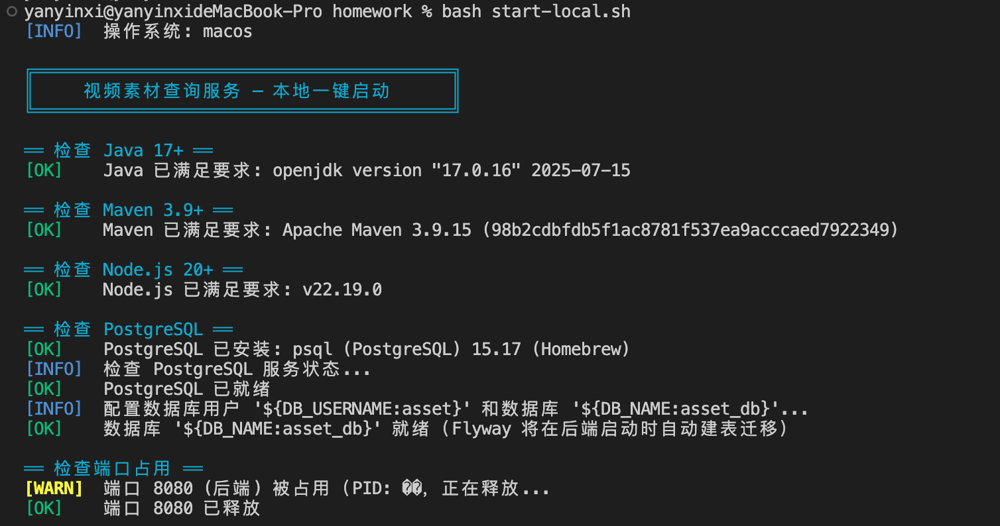 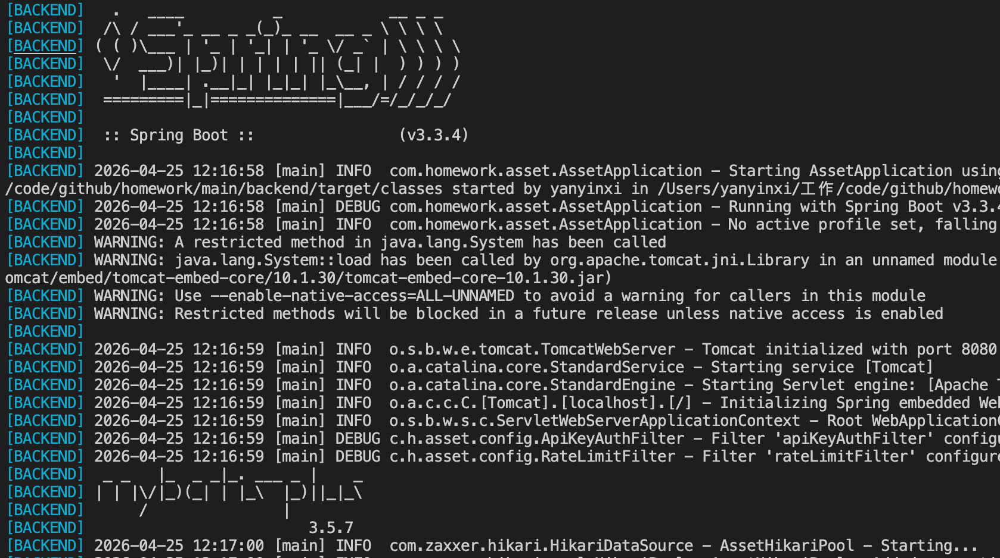 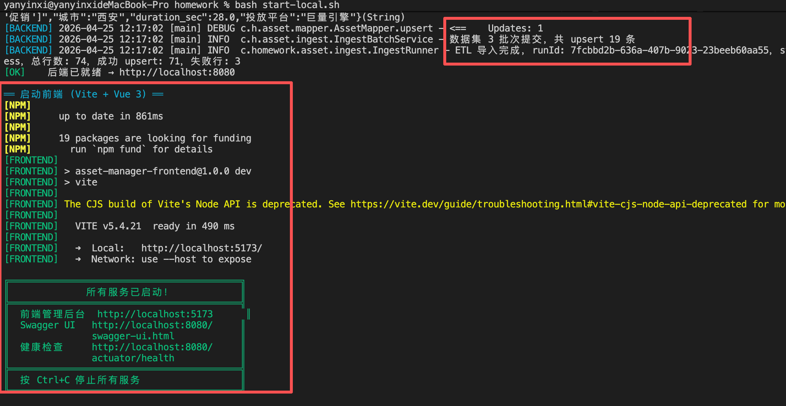

## 一键启动 （有docker， start-docker.sh）
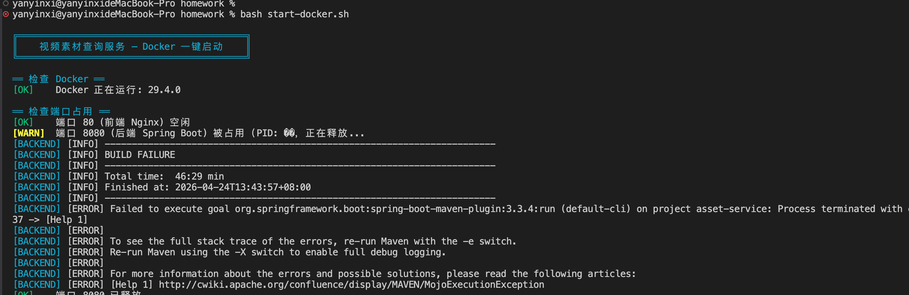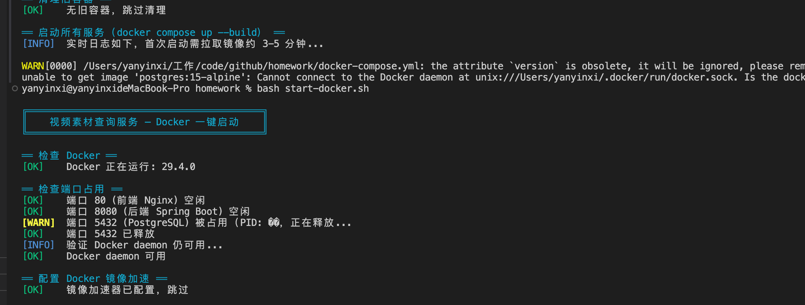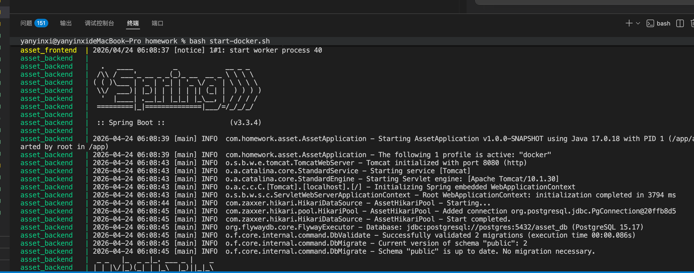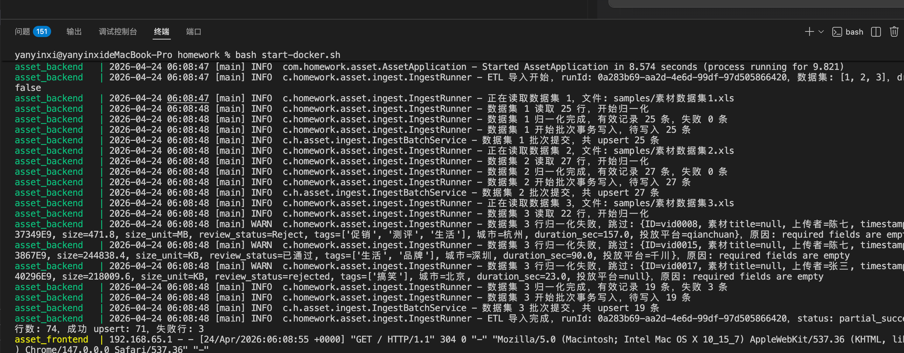

## 页面：
### 数据概览
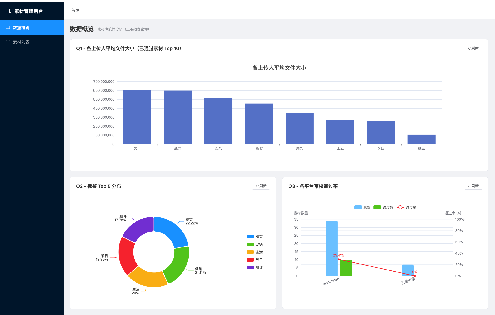
### 素材列表：
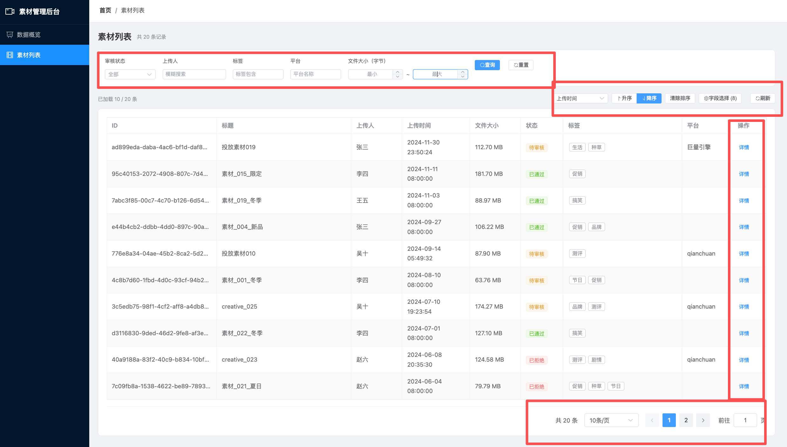
### 展示字段设置：
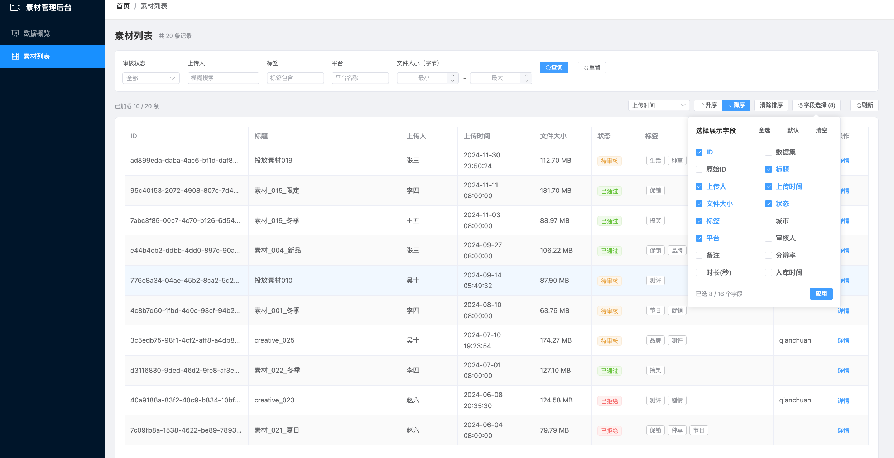

### 上传：
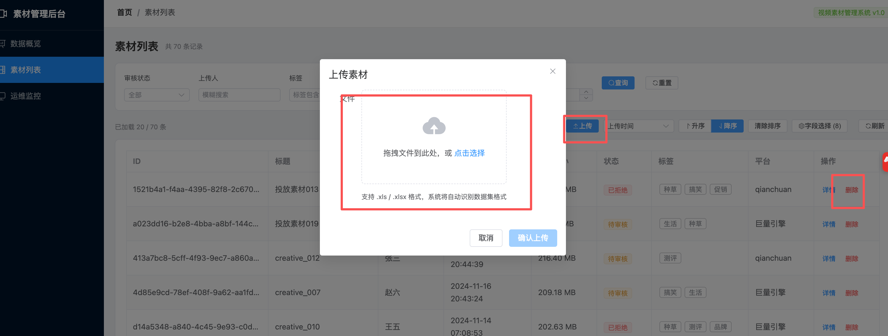

### 详情：
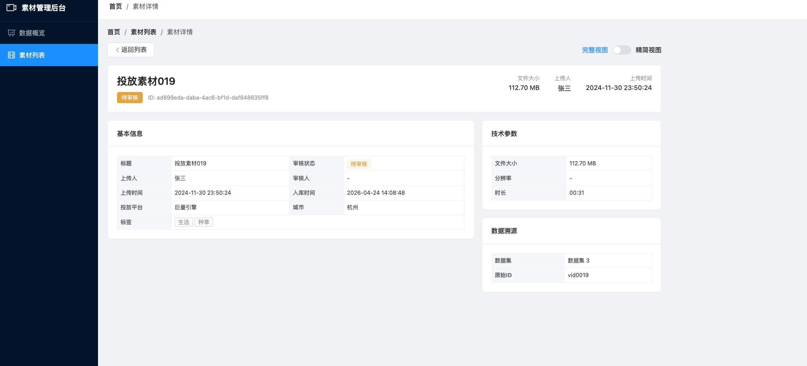

## API接口：
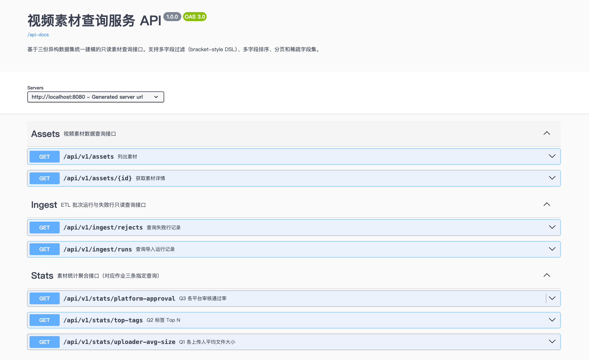

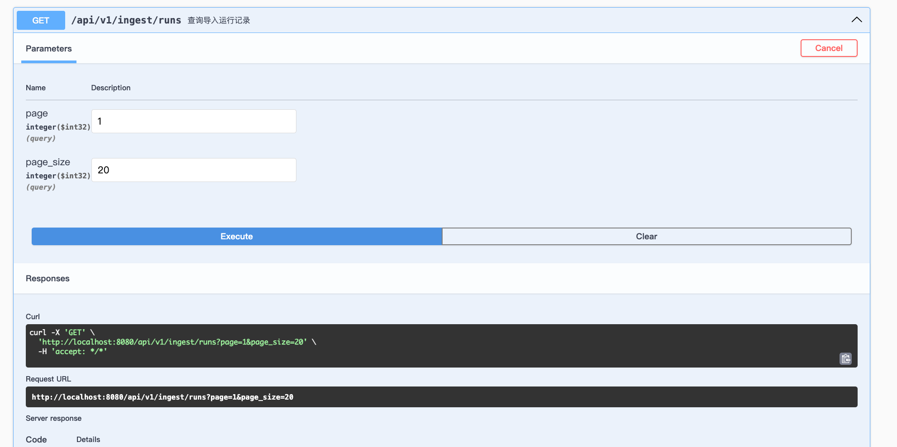

http://localhost:8080/api/v1/ingest/runs?page=1&page_size=20
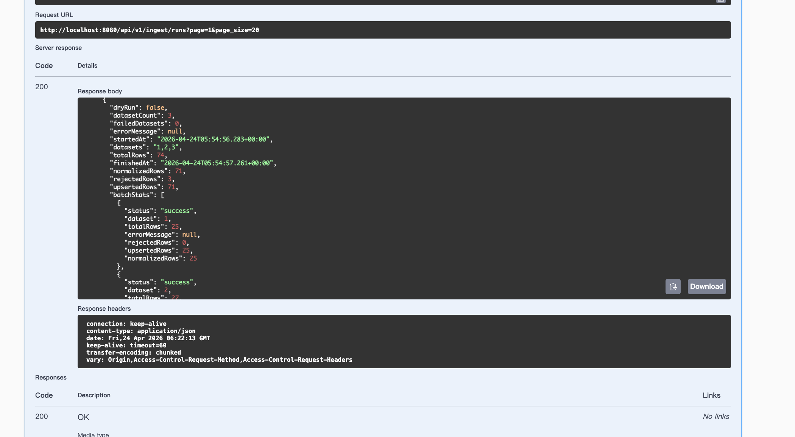

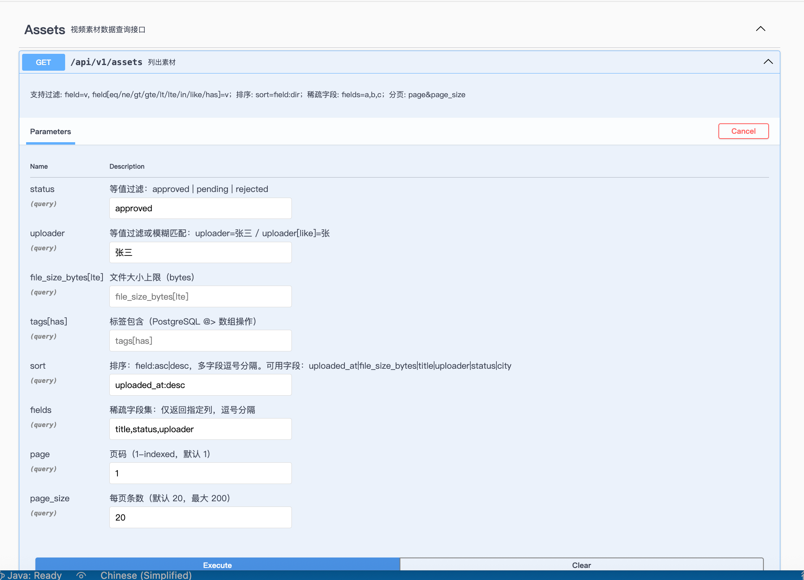
http://localhost:8080/api/v1/assets?status=approved&uploader=%E5%BC%A0%E4%B8%89&sort=uploaded_at%3Adesc&fields=title%2Cstatus%2Cuploader&page=1&page_size=20

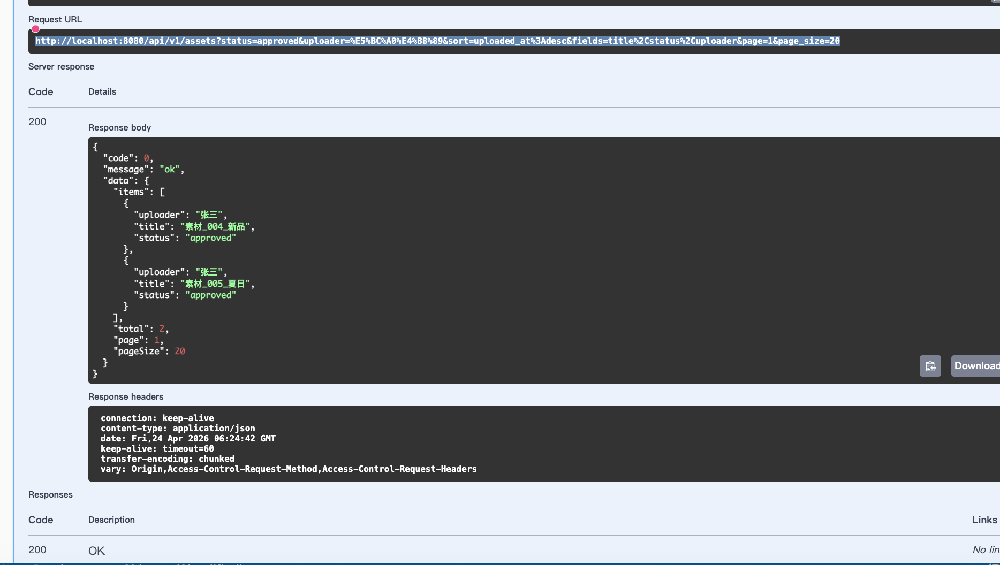
